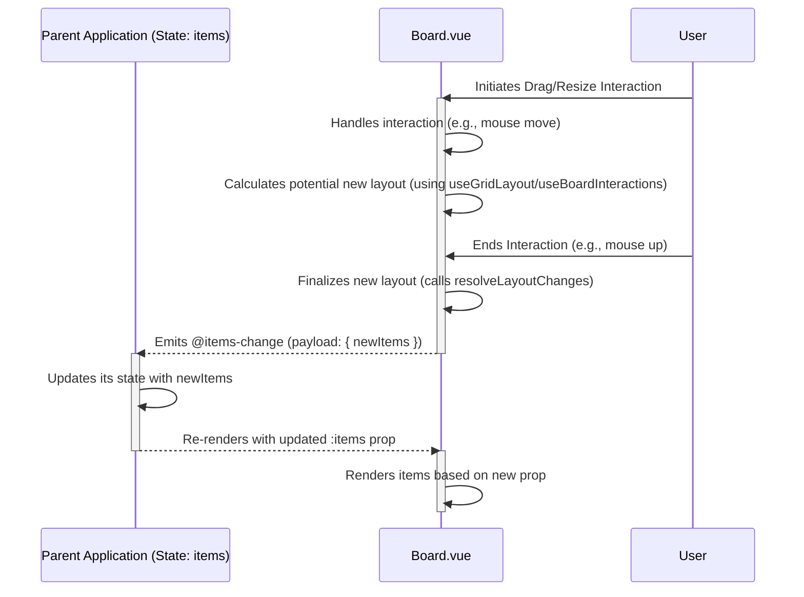

# Cloudscape Board - Architecture Diagrams

This document provides visual diagrams illustrating the architecture and data flow of the `vue-cloudscape-board` component.

## 1. High-Level Component Structure

This diagram shows the relationship between the parent application, the main `Board` component, and the internal `BoardItem` component.

```mermaid
graph TD
    subgraph Parent Application
        direction LR
        AppState[Application State (items array)]
        AppTemplate[Template using Board]
    end

    subgraph vue-cloudscape-board Library
        direction TB
        Board[Board.vue]
        BoardItem[BoardItem.vue (Internal, v-for items)]
        ItemSlotContent{Rendered via #item slot}

        Board -- Renders --> BoardItem
        BoardItem -- Renders --> ItemSlotContent
    end

    AppState -- :items prop --> Board
    Board -- @items-change event --> AppTemplate
    AppTemplate -- Updates --> AppState
    Board -- Provides item data & utils --> ItemSlotContent
    ItemSlotContent -- Calls utils.dismiss / utils.triggerResize --> Board
    Board -- Emits @dismiss-item / @trigger-resize --> AppTemplate

    style Board fill:#f9f,stroke:#333,stroke-width:2px
    style BoardItem fill:#ccf,stroke:#333,stroke-width:1px
```

## 2. Data Flow (Controlled Component Pattern)

This sequence diagram illustrates the flow of data and events for a typical interaction (e.g., drag) that changes the layout.



## 3. Internal Architecture (Composables)

This diagram shows how `Board.vue` utilizes the different composables to manage its functionality.

```mermaid
graph TD
    subgraph Board.vue
        direction TB
        Template[Template (#item slot, v-for)]
        ScriptSetup[script setup lang="ts"]
        Style[style scoped]
    end

    subgraph Composables
        direction TB
        GridLayout[useGridLayout\n(Calculations, Resolve Changes)]
        Interactions[useBoardInteractions\n(Drag/Resize/Keyboard Listeners)]
        Responsiveness[useBoardResponsiveness\n(ResizeObserver, isSingleColumn)]
        Accessibility[useBoardAccessibility\n(ARIA, Live Regions, i18n)]
    end

    ScriptSetup -- Uses --> GridLayout
    ScriptSetup -- Uses --> Interactions
    ScriptSetup -- Uses --> Responsiveness
    ScriptSetup -- Uses --> Accessibility

    GridLayout -- Provides calculated styles --> Template
    Interactions -- Provides interaction state --> Template
    Interactions -- Calls --> GridLayout
    Responsiveness -- Provides isSingleColumn --> GridLayout
    Responsiveness -- Provides isSingleColumn --> Interactions
    Accessibility -- Provides ARIA attrs/handlers --> Template
    Accessibility -- Consumes i18nStrings prop --> ScriptSetup

    style Composables fill:#eee,stroke:#999
```

## 4. Low-Level Interaction Sequence (Example: Drag Operation)

This sequence diagram details the internal calls during a drag operation.

```mermaid
sequenceDiagram
    participant User
    participant BoardItem as BoardItem.vue (Drag Handle)
    participant Interactions as useBoardInteractions
    participant GridLayout as useGridLayout
    participant Board as Board.vue

    User->>BoardItem: PointerDown on Drag Handle
    activate BoardItem
    BoardItem->>Interactions: handleDragStart(itemId, event)
    activate Interactions
    Interactions->>Interactions: Set isDragging=true, store initial pos
    Interactions-->>BoardItem: Return (prevents default)
    deactivate Interactions
    deactivate BoardItem

    User->>BoardItem: PointerMove
    activate BoardItem
    BoardItem->>Interactions: handleDragMove(event)
    activate Interactions
    Interactions->>Interactions: Update temporary visual position (transform)
    Interactions-->>BoardItem: Return
    deactivate Interactions
    deactivate BoardItem

    User->>BoardItem: PointerUp
    activate BoardItem
    BoardItem->>Interactions: handleDragEnd(event)
    activate Interactions
    Interactions->>Interactions: Calculate target grid position
    Interactions->>GridLayout: resolveLayoutChanges(currentItems, itemId, newDefinition)
    activate GridLayout
    GridLayout->>GridLayout: Perform push/swap logic
    GridLayout-->>Interactions: Return resolvedItems array
    deactivate GridLayout
    Interactions->>Board: emit('@items-change', { items: resolvedItems })
    Interactions->>Interactions: Reset isDragging=false
    Interactions-->>BoardItem: Return
    deactivate Interactions
    deactivate BoardItem
